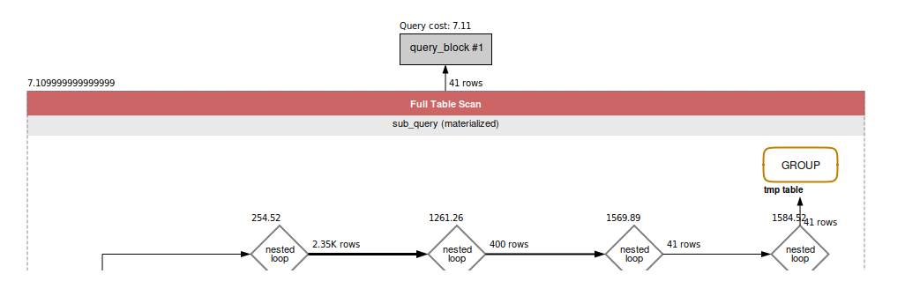

### Question
How many single-item orders were fulfilled from warehouses in the last month?


### Solution

```sql

SELECT 
    COUNT(*)
FROM
    (SELECT 
        COUNT(*) AS TOTAL_COUNT
    FROM
        Order_Item oi
    JOIN order_status os ON os.order_id = oi.order_id
        AND os.order_item_seq_id = oi.order_item_seq_id
    JOIN order_item_ship_group_assoc oisga ON oi.order_id = oisga.order_id
        AND oi.order_item_seq_id = oisga.order_item_seq_id
    JOIN order_item_ship_group oisg ON oisga.ORDER_ID = oisg.ORDER_ID
        AND oisga.SHIP_GROUP_SEQ_ID = oisg.SHIP_GROUP_SEQ_ID
    JOIN facility f ON oisg.FACILITY_ID = f.FACILITY_ID
    WHERE
        f.facility_type_id = 'WAREHOUSE'
            AND os.status_id = 'ITEM_COMPLETED'
            AND os.STATUS_DATETIME >= DATE_SUB(CURDATE(), INTERVAL 1 MONTH)
    GROUP BY oi.order_id
    HAVING COUNT(oi.order_item_seq_id) = 1) AS sub_query;
```


