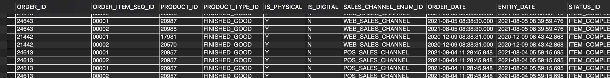

### QUESTION
Fetch the following columns for completed order items for sales orders of SM_STORE product store and that are physical items.
    ORDER_ID
    ORDER_ITEM_SEQ_ID
    PRODUCT_ID
    PRODUCT_TYPE_ID
    IS_PHYSICAL
    IS_DIGITAL
    SALES_CHANNEL_ENUM_ID
    ORDER_DATE
    ENTRY_DATE
    STATUS_ID
    STATUS_DATETIME
    ORDER_TYPE_ID
    PRODUCT_STORE_ID 

### SOLUTION: 
```sql
SELECT 
    oh.ORDER_ID,
    oi.ORDER_ITEM_SEQ_ID,
    p.PRODUCT_ID,
    pt.PRODUCT_TYPE_ID,
    pt.IS_PHYSICAL,
    pt.IS_DIGITAL,
    oh.SALES_CHANNEL_ENUM_ID,
    oh.ORDER_DATE,
    oh.ENTRY_DATE,
    os.STATUS_ID,
    os.STATUS_DATETIME,
    oh.ORDER_TYPE_ID,
    oh.PRODUCT_STORE_ID
FROM order_header oh JOIN order_item oi
ON oi.order_id = oh.order_id JOIN order_status os
ON os.order_id = oi.order_id JOIN product p
ON p.product_id = oi.product_id JOIN product_type pt
ON pt.product_type_id = p.product_type_id
WHERE oh.product_store_id = 'SM_STORE' AND pt.is_physical = 'Y' AND oh.order_type_id = 'SALES_ORDER' AND os.status_id = 'ITEM_COMPLETED';
```

