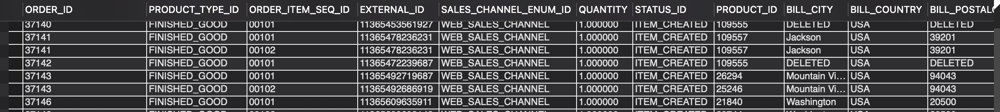

### QUESTION

Fetch all the order items that are in the created status AND the order type should be a sales order
    ORDER_ID
    PRODUCT_TYPE_ID
    ORDER_LINE_ID
    EXTERNAL_ID
    SALES_CHANNEL
    QUANTITY
    ITEM_STATUS 
    PRODUCT_ID
    BILL_CITY
    BILL_COUNTRY
    BILL_POSTALCODE
    BILL_ADDRESS1
    BILL_ADDRESS2
    SHIP_CITY
    SHIP_COUNTRY
    SHIP_POSTALCODE
    SHIP_ADDRESS1
    SHIP_ADDRESS2

### SOLUTION:

```sql

SELECT 
	oh.ORDER_ID,
	p.PRODUCT_TYPE_ID,
	oi.ORDER_ITEM_SEQ_ID,
	oi.EXTERNAL_ID,
	oh.SALES_CHANNEL_ENUM_ID,
	oi.QUANTITY,
	oi.STATUS_ID,
	p.PRODUCT_ID,
	pa.CITY BILL_CITY,
	pa.COUNTRY_GEO_ID BILL_COUNTRY,
	pa.POSTAL_CODE BILL_POSTALCODE,
	pa.ADDRESS1 BILL_ADDRESS1,
	pa.ADDRESS2 BILL_ADDRESS2,
	pa.CITY SHIP_CITY,
	pa.COUNTRY_GEO_ID SHIP_COUNTRY,
	pa.POSTAL_CODE SHIP_POSTALCODE,
	pa.ADDRESS1 SHIP_ADDRESS1,
	pa.ADDRESS2 SHIP_ADDRESS2
FROM order_header oh
JOIN order_item oi ON oh.ORDER_ID = oi.ORDER_ID
JOIN order_contact_mech ocm ON oh.ORDER_ID = ocm.ORDER_ID
JOIN product p ON p.PRODUCT_ID = oi.PRODUCT_ID
LEFT JOIN postal_address pa ON pa.CONTACT_MECH_ID = ocm.CONTACT_MECH_ID
WHERE oi.STATUS_ID = "ITEM_CREATED" AND oh.ORDER_TYPE_ID = "SALES_ORDER"
AND (ocm.CONTACT_MECH_PURPOSE_TYPE_ID = "BILLING_LOCATION" OR ocm.CONTACT_MECH_PURPOSE_TYPE_ID = "SHIPPING_LOCATION");


```

