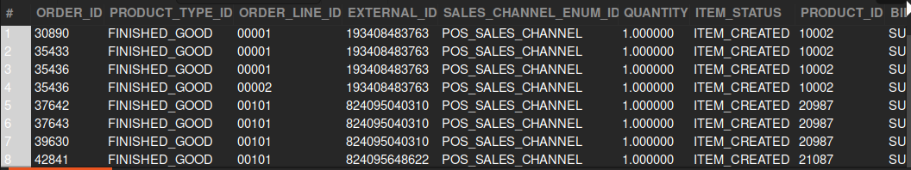

### QUESTION

Fetch all the order items that are in the created status AND the order type should be a sales order
    ORDER_ID
    PRODUCT_TYPE_ID
    ORDER_LINE_ID
    EXTERNAL_ID
    SALES_CHANNEL
    QUANTITY
    ITEM_STATUS 
    PRODUCT_ID
    BILL_CITY
    BILL_COUNTRY
    BILL_POSTALCODE
    BILL_ADDRESS1
    BILL_ADDRESS2
    SHIP_CITY
    SHIP_COUNTRY
    SHIP_POSTALCODE
    SHIP_ADDRESS1
    SHIP_ADDRESS2

### SOLUTION:

```sql

SELECT 
    oi.ORDER_ID,
    p.PRODUCT_TYPE_ID,
    oi.ORDER_ITEM_SEQ_ID,
    oh.EXTERNAL_ID,
    oh.SALES_CHANNEL_ENUM_ID,
    oi.QUANTITY,
    oi.STATUS_ID AS ITEM_STATUS,
    oi.PRODUCT_ID,
    pb.CITY AS BILL_CITY,
    pb.COUNTRY_GEO_ID AS BILL_COUNTRY,
    pb.POSTAL_CODE AS BILL_POSTALCODE,
    pb.ADDRESS1 AS BILL_ADDRESS1,
    pb.ADDRESS2 AS BILL_ADDRESS2,
    ps.CITY AS SHIP_CITY,
    ps.COUNTRY_GEO_ID AS SHIP_COUNTRY,
    ps.POSTAL_CODE AS SHIP_POSTALCODE,
    ps.ADDRESS1 AS SHIP_ADDRESS1,
    ps.ADDRESS2 AS SHIP_ADDRESS2
FROM
    order_header oh
        JOIN
    order_item oi ON oi.ORDER_ID = oh.ORDER_ID
        AND oi.STATUS_ID = 'ITEM_CREATED'
        JOIN
    product p ON oi.PRODUCT_ID = p.PRODUCT_ID
        JOIN
    order_contact_mech ocm_s ON oi.ORDER_ID = ocm_s.ORDER_ID
        AND ocm_s.CONTACT_MECH_PURPOSE_TYPE_ID = 'SHIPPING_LOCATION'
        JOIN
    order_contact_mech ocm_b ON oi.ORDER_ID = ocm_b.ORDER_ID
        AND ocm_b.CONTACT_MECH_PURPOSE_TYPE_ID = 'BILLING_LOCATION'
        JOIN
    postal_address pb ON ocm_b.CONTACT_MECH_ID = pb.CONTACT_MECH_ID
        JOIN
    postal_address ps ON ocm_s.CONTACT_MECH_ID = ps.CONTACT_MECH_ID
    WHERE oh.order_type_id = 'SALES_ORDER';

```



