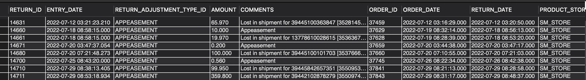

### QUESTION

Get all the appeasements in July month.
How do we differentiate between returns and appeasements?
Get all the below fields 
    RETURN_ID
    ENTRY_DATE 
    RETURN_ADJUSTMENT_TYPE_ID
    AMOUNT
    COMMENTS 
    ORDER_ID
    ORDER_DATE 
    RETURN_DATE
    PRODUCT_STORE_ID


### SOLUTION:

```sql

SELECT
    rh.RETURN_ID, 
    rh.ENTRY_DATE, 
    ra.RETURN_ADJUSTMENT_TYPE_ID, 
    ra.AMOUNT, 
    ra.COMMENTS, 
    ra.ORDER_ID, 
    oh.ORDER_DATE, 
    rh.RETURN_DATE, 
    oh.PRODUCT_STORE_ID
FROM
    return_header rh
JOIN
    return_adjustment ra ON rh.RETURN_ID = ra.RETURN_ID
JOIN
    order_header oh ON ra.ORDER_ID = oh.ORDER_ID
WHERE
    RETURN_ADJUSTMENT_TYPE_ID = 'APPEASEMENT'
    AND rh.RETURN_DATE BETWEEN '2023-07-01' AND '2023-07-31';

```

