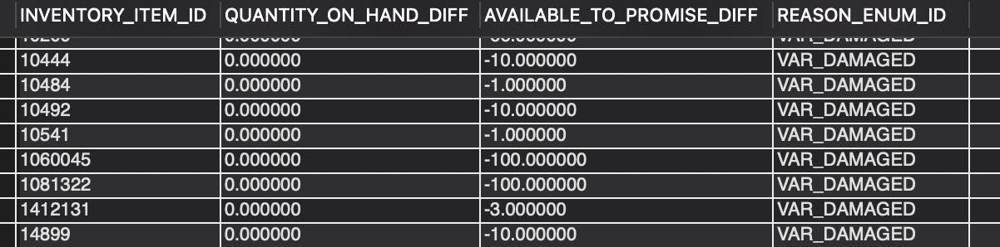

### QUESTION

Fetch the inventory variances of the products where the reason is ‘VAR_LOST’ or VAR_DAMAGED.

### SOLUTION:

```sql

SELECT
    INVENTORY_ITEM_ID,
    QUANTITY_ON_HAND_DIFF,
    AVAILABLE_TO_PROMISE_DIFF,
    REASON_ENUM_ID
FROM inventory_item_detail
WHERE REASON_ENUM_ID IN ('VAR_LOST', 'VAR_DAMAGED');


```

