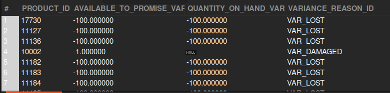
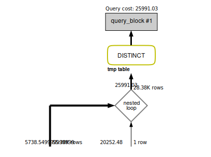

### QUESTION

Fetch the inventory variances of the products where the reason is ‘VAR_LOST’ or VAR_DAMAGED.

### SOLUTION:

```sql

SELECT
	DISTINCT ii.PRODUCT_ID, 
	iiv.AVAILABLE_TO_PROMISE_VAR,
	iiv.QUANTITY_ON_HAND_VAR,
	iiv.VARIANCE_REASON_ID 
FROM inventory_item ii 
JOIN inventory_item_variance iiv ON ii.INVENTORY_ITEM_ID = iiv.INVENTORY_ITEM_ID 
AND (iiv.VARIANCE_REASON_ID = "VAR_LOST" OR iiv.VARIANCE_REASON_ID = "VAR_DAMAGED");


```



