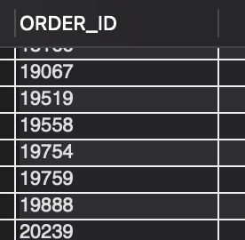

### QUESTION

Find all the orders that have more than one return.

### SOLUTION:

```

SELECT ri.ORDER_ID
FROM return_item ri
JOIN Order_Item oi ON ri.ORDER_ID = oi.ORDER_ID AND ri.ORDER_ITEM_SEQ_ID = oi.ORDER_ITEM_SEQ_ID
GROUP BY ri.ORDER_ID
HAVING COUNT(DISTINCT ri.RETURN_ID) > 1;


```

