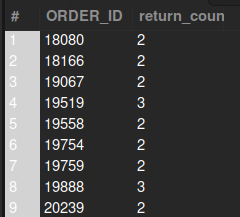

### QUESTION

Find all the orders that have more than one return.

### SOLUTION:

```sql

SELECT ri.ORDER_ID, COUNT(DISTINCT ri.RETURN_ID) AS return_count FROM return_item ri 
WHERE ri.order_id IS NOT NULL
GROUP BY ri.ORDER_ID
HAVING return_count > 1;

```

