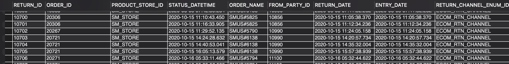

### Question
Fetch the following columns for completed return items of SM_STORE for ecom return channel.
    RETURN_ID 
    ORDER_ID
    PRODUCT_STORE_ID 
    STATUS_DATETIME
    ORDER_NAME 
    FROM_PARTY_ID 
    RETURN_DATE 
    ENTRY_DATE
    RETURN_CHANNEL_ENUM_ID

### SOLUTION:
```sql
SELECT 
	rh.RETURN_ID,
	oh.ORDER_ID,
	oh.PRODUCT_STORE_ID ,
	rs.STATUS_DATETIME,
	oh.ORDER_NAME ,
	rh.FROM_PARTY_ID, 
	rh.RETURN_DATE ,
	rh.ENTRY_DATE,
	rh.RETURN_CHANNEL_ENUM_ID
FROM return_header rh JOIN
return_item ri ON rh.RETURN_ID = ri.RETURN_ID
JOIN order_item oi ON ri.ORDER_ID = oi.ORDER_ID AND ri.ORDER_ITEM_SEQ_ID = oi.ORDER_ITEM_SEQ_ID
JOIN order_header oh ON oi.ORDER_ID = oh.ORDER_ID
JOIN return_status rs ON ri.RETURN_ID = rs.RETURN_ID AND ri.RETURN_ITEM_SEQ_ID = rs.RETURN_ITEM_SEQ_ID
WHERE oh.PRODUCT_STORE_ID = 'SM_STORE' AND rs.STATUS_ID = 'RETURN_COMPLETED' 
AND rh.RETURN_CHANNEL_ENUM_ID = 'ECOM_RTN_CHANNEL';
```

