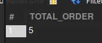
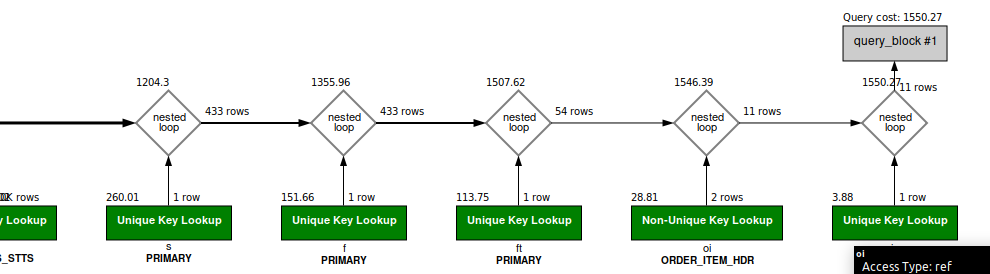

### Question
3. In the period following the New Year, what is the number of orders shipped from stores in the first 25 days?


### Solution

```sql

SELECT COUNT(distinct oi.ORDER_ID) as TOTAL_ORDER FROM Order_Item oi
JOIN order_item_ship_group oisg ON oi.ORDER_ID = oisg.ORDER_ID and oi.SHIP_GROUP_SEQ_ID = oisg.SHIP_GROUP_SEQ_ID 
JOIN shipment s ON s.PRIMARY_ORDER_ID = oisg.order_id AND s.PRIMARY_SHIP_GROUP_SEQ_ID = oisg.ship_group_seq_id
JOIN shipment_status ss ON ss.SHIPMENT_ID = s.shipment_id AND ss.status_id = "SHIPMENT_SHIPPED"
JOIN facility f ON s.ORIGIN_FACILITY_ID = f.FACILITY_ID
JOIN facility_type ft ON ft.FACILITY_TYPE_ID = f.FACILITY_TYPE_ID
WHERE ft.PARENT_TYPE_ID = 'PHYSICAL_STORE'  AND (ss.STATUS_DATE >= '2024-01-01'
AND ss.STATUS_DATE < '2024-01-01' + INTERVAL 25 day)
AND s.status_id = "SHIPMENT_SHIPPED";

```



