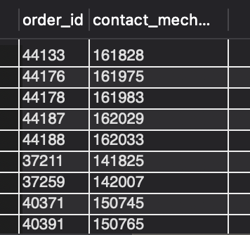
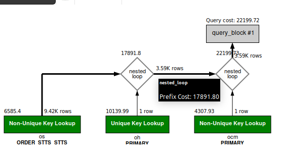

### Question
Fetch the order id and contact mech id for the shipping address of the orders completed in October of 2023.

### SOLUTION:

```sql
SELECT oh.order_id, ocm.contact_mech_id 
FROM order_header oh 
JOIN order_contact_mech ocm ON oh.order_id = ocm.order_id AND ocm.contact_mech_purpose_type_id = 'SHIPPING_LOCATION' 
JOIN order_status os ON os.order_id = oh.order_id AND  os.status_id = 'ORDER_COMPLETED' 
WHERE oh.status_id = 'ORDER_COMPLETED'
AND EXTRACT(YEAR FROM os.status_datetime) = '2023' 
AND EXTRACT(MONTH FROM os.status_datetime) = '10';
```



