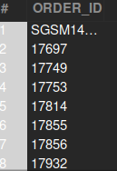

### Question
4. What is the total number of orders originating from New York?


### Solution

```sql

SELECT (DISTINCT oh.ORDER_ID)
FROM
    order_header oh
JOIN
    order_role or2 ON (or2.ORDER_ID = oh.ORDER_ID AND or2.ROLE_TYPE_ID = 'PLACING_CUSTOMER')
JOIN
    party_contact_mech_purpose pcmp ON (or2.PARTY_ID = pcmp.PARTY_ID AND pcmp.CONTACT_MECH_PURPOSE_TYPE_ID = 'SHIPPING_LOCATION')
JOIN
    postal_address pa ON (pa.CONTACT_MECH_ID = pcmp.CONTACT_MECH_ID AND pa.city = 'New York')
WHERE
    oh.STATUS_ID NOT IN ('ORDER_CANCELLED', 'ORDER_REJECTED');
```



