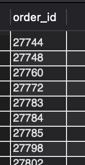
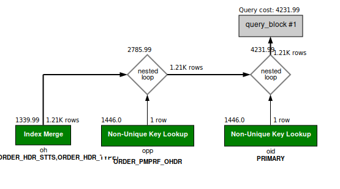

### Question

Fetch the following columns for created orders. These should be sales orders.
	ORDER_ID
	TOTAL_AMOUNT
	PAYMENT_METHOD
	SHOPIFY_ORDER_NAME

NOTE: 
- The total amount represents the total amount of the order.
- The payment method is the method by which payment was made, like Cash, mastercard, visa, paypal, etc.


### SOLUTION:

```sql
SELECT 
	oh.ORDER_ID,
	oh.grand_total as TOTAL_AMOUNT,
	opp.PAYMENT_METHOD_TYPE_ID as PAYMENT_METHOD,
	oid.ID_VALUE as SHOPIFY_ORDER_NAME
FROM order_header oh 
JOIN order_identification oid ON oid.order_id = oh.order_id AND oid.ORDER_IDENTIFICATION_TYPE_ID = 'SHOPIFY_ORD_NAME' AND oid.thru_date IS NULL 
JOIN order_payment_preference opp ON opp.order_id = oh.order_id
WHERE oh.order_type_id = 'SALES_ORDER' AND oh.status_id = 'ORDER_CREATED';

```



