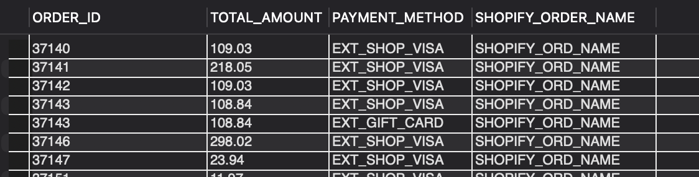

### Question
4. What is the total number of orders originating from New York?


### Solution

```sql

SELECT distinct oh.order_id FROM order_header oh
JOIN order_contact_mech ocm ON ocm.order_id = oh.order_id
JOIN contact_mech cm ON cm.CONTACT_MECH_ID = ocm.CONTACT_MECH_ID
JOIN contact_mech_type cmt ON cmt.CONTACT_MECH_TYPE_ID = cm.CONTACT_MECH_TYPE_ID
JOIN contact_mech_type_purpose cmtp ON cmtp.CONTACT_MECH_TYPE_ID = cmt.CONTACT_MECH_TYPE_ID
JOIN postal_address pa ON pa.CONTACT_MECH_ID = cm.CONTACT_MECH_ID
WHERE pa.CITY = "NEW YORK" AND cmtp.CONTACT_MECH_PURPOSE_TYPE_ID = 'SHIPPING_LOCATION';

```

