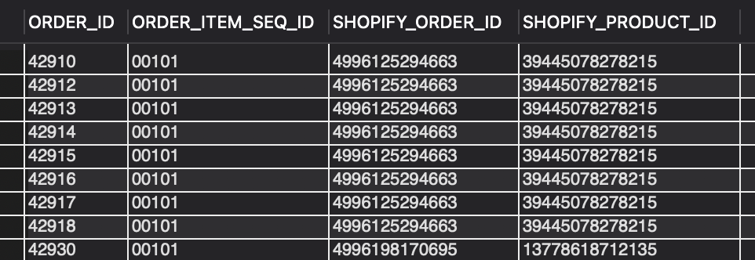
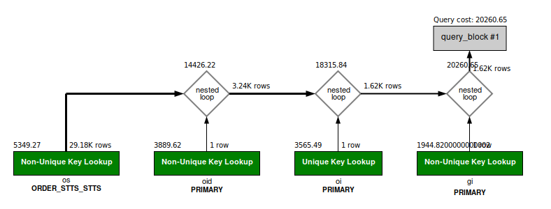

### QUESTION

Fetch the following data for completed order items in July of 2023
    ORDER_ID
    ORDER_ITEM_SEQ_ID
    SHOPIFY_ORDER_ID
    SHOPIFY_PRODUCT_ID


### SOLUTION:

```sql
SELECT
	oi.ORDER_ID,
	oi.ORDER_ITEM_SEQ_ID,
	oid.id_value as SHOPIFY_ORDER_ID,
	gi.id_value as SHOPIFY_PRODUCT_ID
FROM order_item oi 
JOIN order_identification oid ON oi.order_id = oid.order_id
JOIN good_identification gi ON gi.product_id = oi.product_id
JOIN order_status os ON os.order_id = oi.order_id AND os.order_item_seq_id = oi.order_item_seq_id AND os.status_id = 'ITEM_COMPLETED'
WHERE oi.status_id = 'ITEM_COMPLETED'
AND oid.ORDER_IDENTIFICATION_TYPE_ID = 'SHOPIFY_ORD_ID'
AND gi.GOOD_IDENTIFICATION_TYPE_ID = 'SHOPIFY_PROD_ID'
AND os.status_datetime >= '2023-07-01 00:00:00.000' AND  os.status_datetime < '2023-08-01';
```



