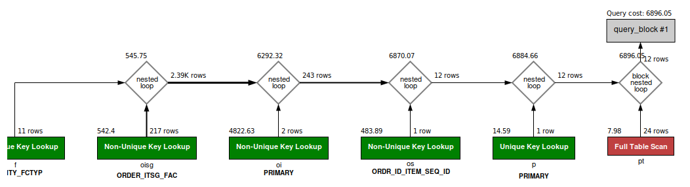

### QUESTION

Fetch all the physical items completed from Warehouse in September of 2023.

### SOLUTION:

```sql
SELECT oi.ORDER_ID, oi.order_item_seq_id, f.facility_id FROM order_item oi
JOIN order_item_ship_group oisg ON oi.ORDER_ID = oisg.ORDER_ID and oi.SHIP_GROUP_SEQ_ID = oisg.SHIP_GROUP_SEQ_ID 
JOIN order_status os ON os.order_id = oi.order_id AND os.order_item_seq_id = oi.order_item_seq_id AND os.status_id = 'ITEM_COMPLETED'
JOIN product p ON oi.product_id = p.product_id
JOIN product_type pt ON pt.product_type_id = p.product_type_id
JOIN facility f ON oisg.FACILITY_ID = f.FACILITY_ID AND f.FACILITY_TYPE_ID = "WAREHOUSE"
WHERE pt.is_physical = 'Y' AND oi.status_id = 'ITEM_COMPLETED' 
AND os.status_datetime >= DATE '2023-09-01' AND  os.status_datetime < '2023-10-01';

```


