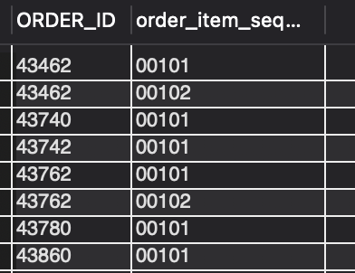

### QUESTION

Fetch all the physical items completed from Warehouse in September of 2023.

### SOLUTION:

```sql
SELECT oi.ORDER_ID, oisga.order_item_seq_id FROM order_item oi
JOIN order_item_ship_group_assoc oisga ON oi.order_id = oisga.order_id AND oi.order_item_seq_id = oisga.order_item_seq_id
JOIN order_item_ship_group oisg ON oisga.ORDER_ID =oisg.ORDER_ID and oisga.SHIP_GROUP_SEQ_ID = oisg.SHIP_GROUP_SEQ_ID 
JOIN order_status os ON os.order_id = oisga.order_id AND os.order_item_seq_id = oisga.order_item_seq_id
JOIN product p ON oi.product_id = p.product_id
JOIN product_type pt ON pt.product_type_id = p.product_type_id
JOIN facility f ON oisg.FACILITY_ID = f.FACILITY_ID
WHERE pt.is_physical = 'Y' AND os.status_id = 'ITEM_COMPLETED' AND f.FACILITY_TYPE_ID = "WAREHOUSE"
AND EXTRACT(YEAR FROM os.status_datetime)="2023"
AND EXTRACT(MONTH FROM os.status_datetime)="9";

```

