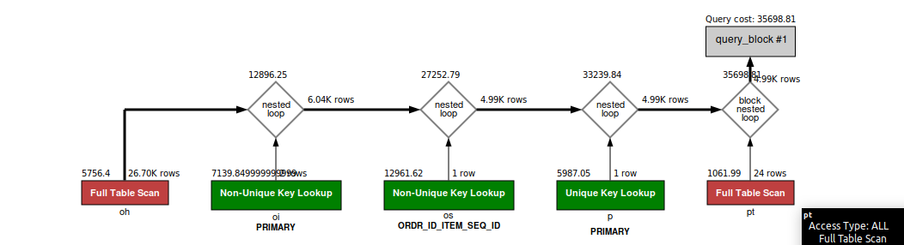

### QUESTION

Fetch all the physical items ordered in the month of September 2023.

### SOLUTION:

```sql
SELECT oi.ORDER_ID, oi.ORDER_ITEM_SEQ_ID FROM order_header oh
JOIN order_item oi ON oi.order_id = oh.order_id
JOIN order_status os ON oi.ORDER_ID = os.ORDER_ID AND oi.ORDER_ITEM_SEQ_ID = os.ORDER_ITEM_SEQ_ID
JOIN product p ON oi.product_id = p.product_id
JOIN product_type pt ON pt.product_type_id = p.product_type_id AND pt.is_physical = 'Y'
WHERE os.status_id = 'ITEM_CREATED'
AND (oh.order_date >="2023-09-01 00:00:00.000" AND oh.order_date <= "2023-09-30 23:59:59.999");

```


