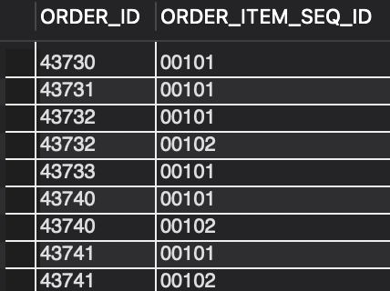

### QUESTION

Fetch all the physical items ordered in the month of September 2023.

### SOLUTION:

```sql
SELECT oi.ORDER_ID, oi.ORDER_ITEM_SEQ_ID FROM order_item oi 
JOIN order_status os ON oi.ORDER_ID = os.ORDER_ID and oi.ORDER_ITEM_SEQ_ID = os.ORDER_ITEM_SEQ_ID
JOIN product p ON oi.product_id = p.product_id
JOIN product_type pt ON pt.product_type_id = p.product_type_id 
WHERE  pt.is_physical = 'Y' AND os.status_id = 'ITEM_CREATED'
AND EXTRACT(YEAR FROM os.status_datetime) = "2023"
AND EXTRACT(MONTH FROM os.status_datetime) = "9";

```

