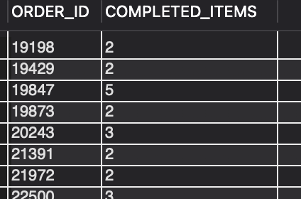

### Question
8. How many orders with a single return were recorded in the last month?

### Solution

```sql

SELECT ri.ORDER_ID, COUNT(DISTINCT ri.RETURN_ID) AS TOTAL_RETURNS FROM return_header rh
JOIN return_item ri ON ri.RETURN_ID = rh.RETURN_ID
LEFT JOIN return_status rs ON rs.RETURN_ID = ri.RETURN_ID AND rs.RETURN_ITEM_SEQ_ID = ri.RETURN_ITEM_SEQ_ID
WHERE rs.STATUS_DATETIME >= DATE_SUB(CURDATE(), INTERVAL 1 MONTH)
GROUP BY ri.ORDER_ID
HAVING TOTAL_RETURNS = 1;

```

