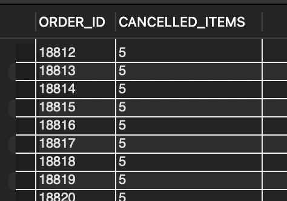

### QUESTION

Find all the orders whose two or more items are canceled but the orders are still in the approved status.

### SOLUTION:

```sql
SELECT
    oi.ORDER_ID,
    COUNT(DISTINCT oi.ORDER_ITEM_SEQ_ID) AS CANCELLED_ITEMS
FROM order_item oi
JOIN order_status os ON oi.ORDER_ID = os.ORDER_ID
JOIN order_header oh ON oi.ORDER_ID = oh.ORDER_ID
WHERE oi.STATUS_ID = 'ITEM_CANCELLED' AND oh.STATUS_ID = 'ORDER_APPROVED'
GROUP BY oi.ORDER_ID
HAVING CANCELLED_ITEMS > 1;

```

